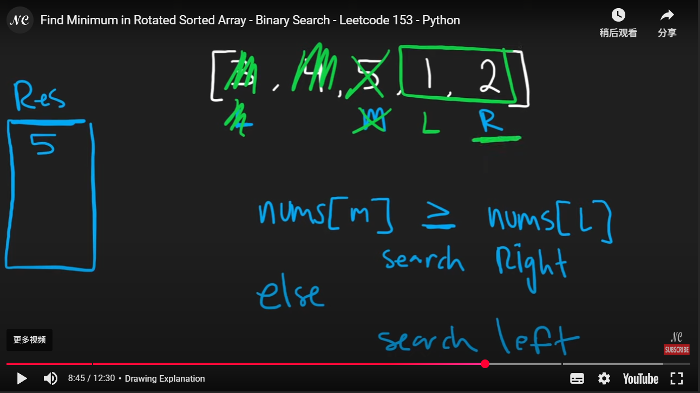
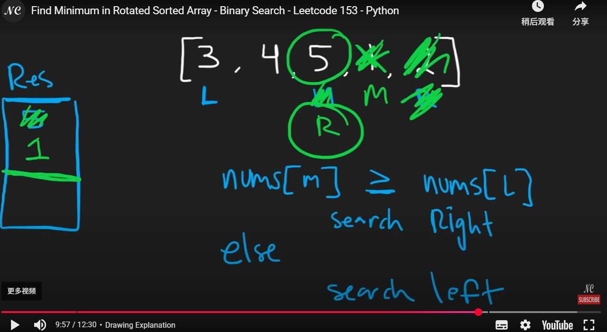
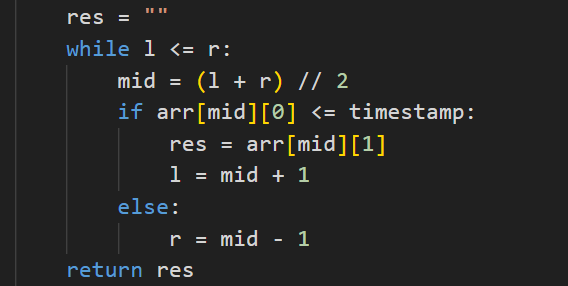
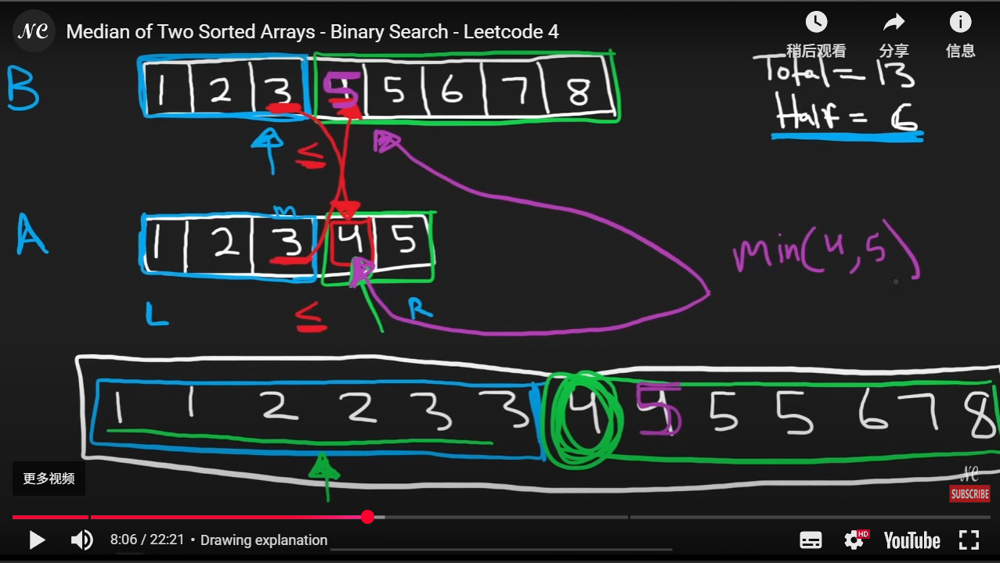
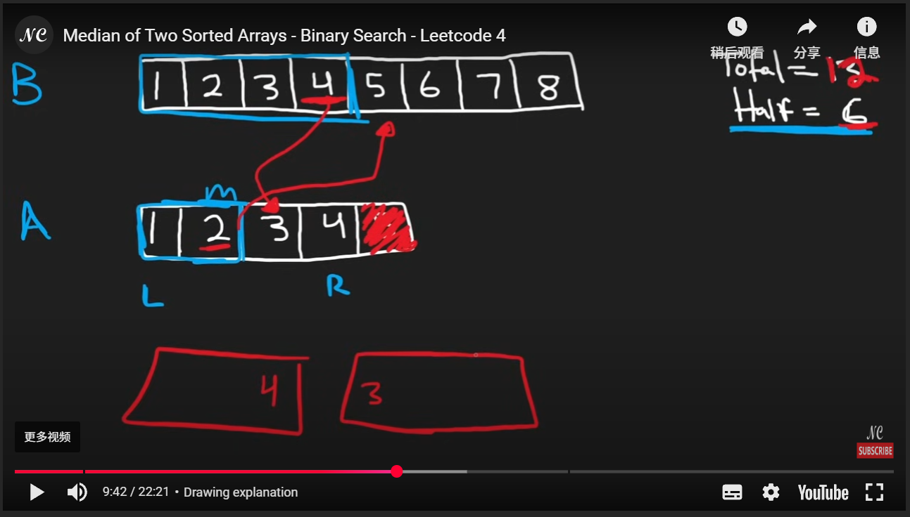
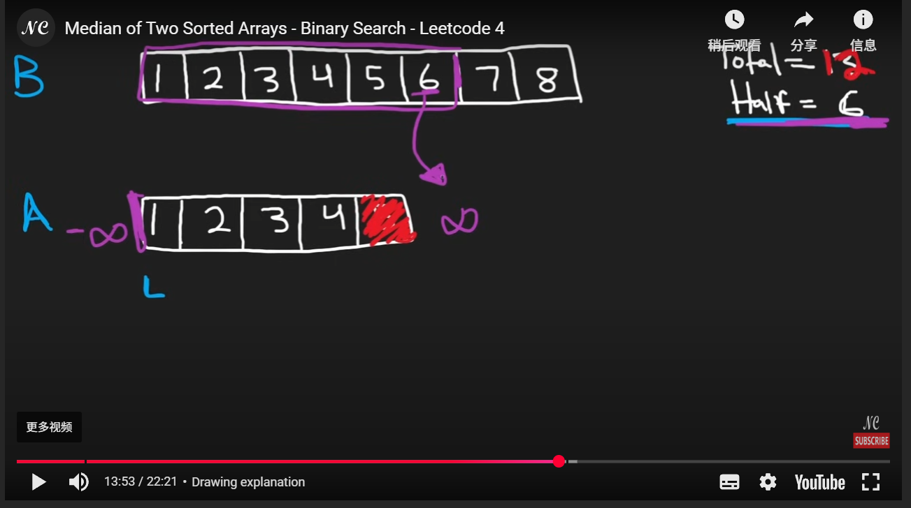

## Binary Search

```python
class Solution:
    def search(self, nums: List[int], target: int) -> int:
        # sorted -> binary search
        left = 0
        right = len(nums) - 1
        while left <= right:
            # mid = (left + right) // 2 # Possible overflow error
            mid = left + (right - left) // 2
            if nums[mid] == target:
                return mid
            elif nums[mid] < target:
                left = mid + 1
            else:
                right = mid - 1
        return -1

```

## Modified Binary Search

```python
def binary_search(arr: List[int], target: int) -> int:
    left, right = 0, len(arr) - 1
    first_true_index = -1 # notice sometimes we need to return the value, an empty value/string might be better
    while left <= right:
        mid = (left + right) // 2
        if feasible(mid):
            first_true_index = mid
            right = mid - 1
        else:
            left = mid + 1

    return first_true_index

```


## Search a 2D Matrix

We could use the 2D matrix property, first do binary search on the row. Compare the first index with target, if it is smaller, we know that we need to decrease our mid, if it is greater than the last index, then we increase our mid + 1. It will break if the row[0] <= target <= row[-1].

## Koko Eating Bananas

We need to do define a function that count the number of bananas. Sometimes it might take some time to come up the idea, for this case, we need to realize since we are trying to find the minimum number up to the max value with in the array. A modifies binary search converge to the max value would be solution in this case.

## Find Minimum in Rotated Sorted Array

1. The array is **partially sorted**, but **rotated at some pivot**.

2. We aim to search in the **sorted portion** where the minimum must lie.

3. **Observation:**

   - If `nums[l] < nums[r]`, the subarray `[l..r]` is already sorted → minimum is `nums[l]`.
   - If `nums[mid] < nums[r]`, the **right half** is sorted → minimum might be in the **left half**, including `mid`.
   - Else, the **left half** is sorted → minimum must be in the **right half** (excluding `mid`).

4. Keep narrowing the range based on which half is sorted.

   Always update `res` with the smallest seen so far: `res = min(res, nums[mid])`.





Another approach is modified binary search but 

## Search in Rotated Sorted Array

This question is similar to the last question, one mistake I made is that `if nums[mid] >= nums[l]: # left sorted half` where I wrote ` >`, the idea to understand is that for some corner cases when mid == l, we still want to make sure it is within the left sorted half instead of the right half.

## Time Based Key-Value Store

A key observation is that we can use a dictionary with the list as a value for data storing. And another thing is that when performing the modified binary search, if like the usual way storing the res as an index. It will return the last element if no value is found, which need to be careful for this.

 

## Median of Two Sorted Arrays

The core idea is about find the correct left and right partition.

Below 3 pictures demonstrate the core idea. 





