## Reverse Linked List

Main idea is about switching the direction between 2 nodes by using 2 variables, similar to the swapping algorithm, keep a variable of the next one and switching the prev and curr places, then finally reassigning.

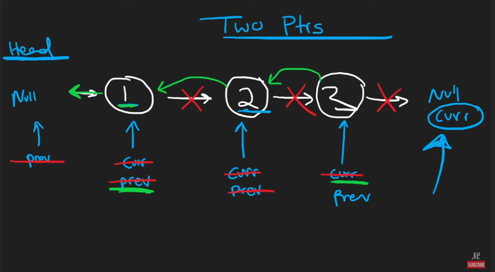

```python
class Solution:
    def reverseList(self, head: Optional[ListNode]) -> Optional[ListNode]:
        prev, curr = None, head

        while curr:
            nxt = curr.next
            curr.next = prev
            prev = curr
            curr = nxt
        
        return prev
```


## Merge Two Sorted Linked Lists

Notice that linked list is stored in memory, so reassigning the order wouldn't need extra space, get confused for the in-place changing at first.

```python
class Solution:
    def mergeTwoLists(self, list1: Optional[ListNode], list2: Optional[ListNode]) -> Optional[ListNode]:
        dummy = tail = ListNode()
        while list1 and list2:
            if list2.val <= list1.val:
                tail.next = list2
                list2 = list2.next
            else:
                tail.next = list1
                list1 = list1.next
            tail = tail.next

        if list1:
            tail.next = list1
        elif list2:
            tail.next = list2

        return dummy.next
```

## Linked List Cycle Detection

A good way to remember is that start at the same position, and fast pointer moves by 2. So we want to check that fast and fast.next if it's null, cuz it would throw an error if we indexing the null since we are incrementing the fast pointer by 2 then we can compare with the slow and fast.

```python
class Solution:
    def hasCycle(self, head: Optional[ListNode]) -> bool:
        # 2 pointers, a cycle would never reach the end
        slow, fast = head, head
        
        while fast and fast.next:
            slow = slow.next
            fast = fast.next.next
            if slow == fast:
                return True

        return False
```

## Reorder Linked List

We can find that is about moving the left and right pointer, the issue is that for linked list we can't easily get the prev list, we can solve this by reversing the second half then using the 2 pointers.


An efficient way to find the mid position is to use a slow and fast pointer.

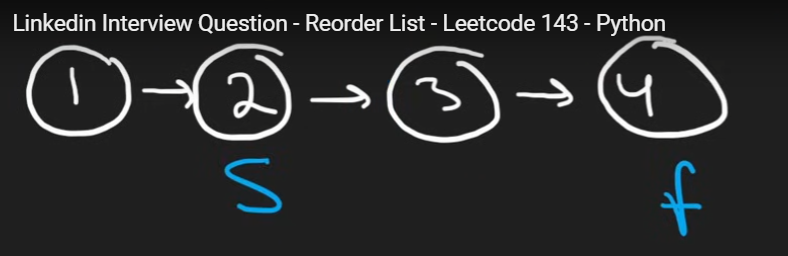

https://leetcode.com/problems/middle-of-the-linked-list/

```python
class Solution:
    def middleNode(self, head: Optional[ListNode]) -> Optional[ListNode]:
        slow, fast = head, head

        while fast and fast.next:
            slow = slow.next
            fast = fast.next.next
        
        return slow
```

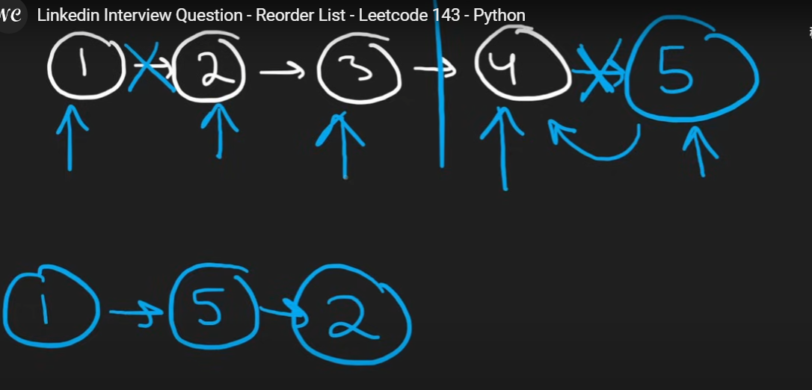

Notice that how we use slow.next = None to break the linked list into half.

```python
# Definition for singly-linked list.
# class ListNode:
#     def __init__(self, val=0, next=None):
#         self.val = val
#         self.next = next

class Solution:
    def reorderList(self, head: Optional[ListNode]) -> None:
        slow, fast = head, head

        while fast and fast.next:
            slow = slow.next
            fast = fast.next.next

        prev, curr = None, slow.next # curr now holds a reference to the node *after* slow
        slow.next = None # breaks the first half of the list by setting slow.next to None
        #reverse the linked list
        while curr:
            nxt = curr.next
            curr.next = prev
            prev = curr
            curr = nxt

        first, second = head, prev
        while second:
            tmp1, tmp2 = first.next, second.next
            first.next = second
            second.next = tmp1
            first, second = tmp1, tmp2

```

## Remove Node From End of Linked List

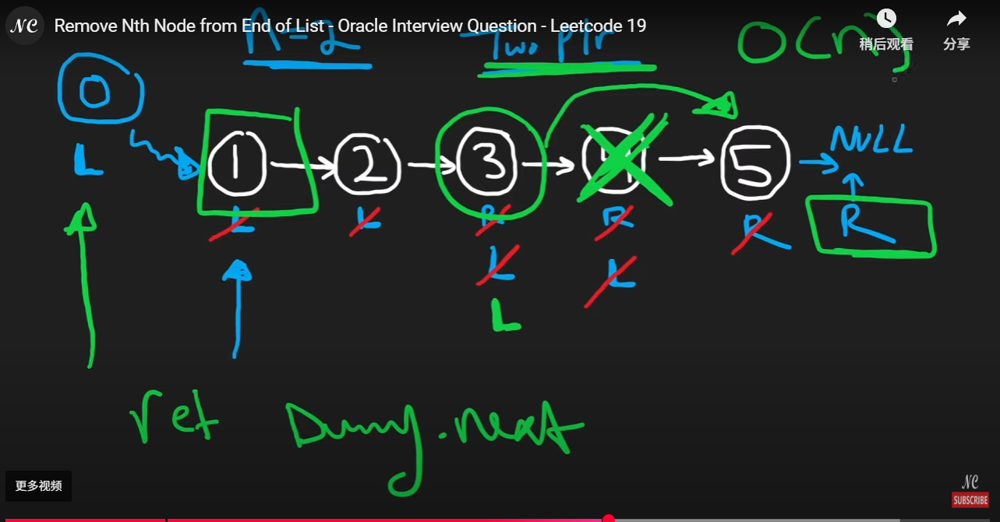

```python
class Solution:
    def removeNthFromEnd(self, head: Optional[ListNode], n: int) -> Optional[ListNode]:
        # two pointers with n incrementing space to know the end
        # dummy = head
        dummy = slow = ListNode(next = head)
        fast = head
        for _ in range(n):
            fast = fast.next

        while fast:
            slow = slow.next
            fast = fast.next
        
        # remove = slow.next
        # slow.next = remove.next
        slow.next = slow.next.next # another way to delete

        return dummy.next
```

## Copy Linked List with Random Pointer

Core idea is that we want to construct a hashmap that stores each node as the key, and also create a corresponding newNode for each node. So that on the next iteration we can connect the hashmap value based on the current node.

```python
class Solution:
    def copyRandomList(self, head: 'Optional[Node]') -> 'Optional[Node]':
        if head is None:
            return None

        tail = head
        table = {None: None} # key: node, value: newNode

        while tail:
            table[tail] = Node(tail.val)
            tail = tail.next
        tail = head
        
        while tail:
            table[tail].next = table[tail.next]
            table[tail].random = table[tail.random]
            tail = tail.next

        return table[head]
```

We can also optimize this to O(1) auxiliary space.

Step1:

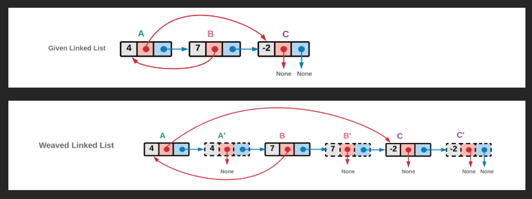

Step2:

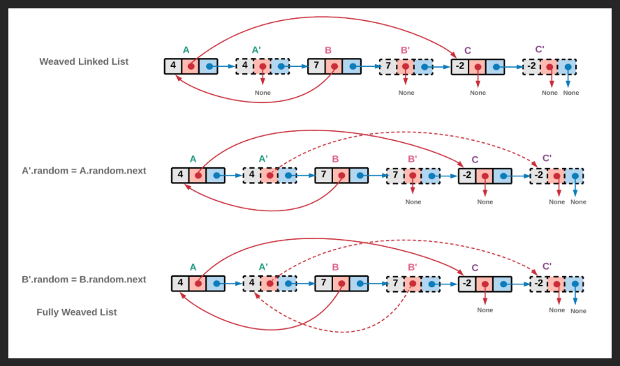

Step3:

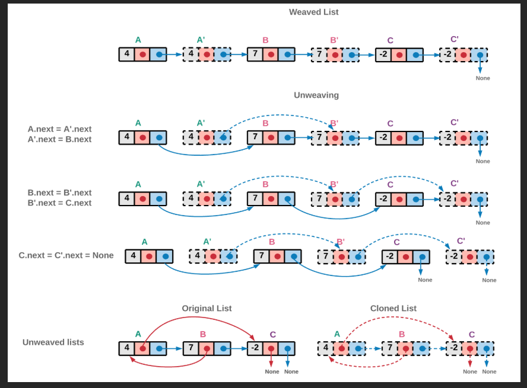

```python
class Solution:
    def copyRandomList(self, head: 'Optional[Node]') -> 'Optional[Node]':
        if not head:
            return None
        
        node = head
        while node:
            nxt = node.next
            node.next = Node(node.val) # Create a clone
            node.next.next = nxt
            node = nxt

        # Assign the random
        node = head
        while node:
            random_node = node.random
            if random_node:
                node.next.random = random_node.next
            node = node.next.next
        
        # Now reconstructing the original list and also store the new list
        node = head
        copy_node = clone = head.next
        while node:
            node.next = node.next.next
            clone.next = (clone.next.next if clone.next else None)
            node = node.next
            clone = clone.next
        
        return copy_node
```

## Add Two Numbers

Not too many tricks, just be careful to handle the length and carry.

```python
class Solution:
    def addTwoNumbers(self, l1: Optional[ListNode], l2: Optional[ListNode]) -> Optional[ListNode]:
        dummy = ListNode()
        cur = dummy

        carry = 0
        while l1 or l2 or carry:
            v1 = l1.val if l1 else 0
            v2 = l2.val if l2 else 0

            # new digit
            val = v1 + v2 + carry
            carry = val // 10
            val = val % 10
            cur.next = ListNode(val)

            # update ptrs
            cur = cur.next
            l1 = l1.next if l1 else None
            l2 = l2.next if l2 else None

        return dummy.next
```

## Find the Duplicate Number - Floyd's Cycle Detection

1) Linked List Cycle
2) Floyd's

2 iterations: 

1st first find the start and slow pointer

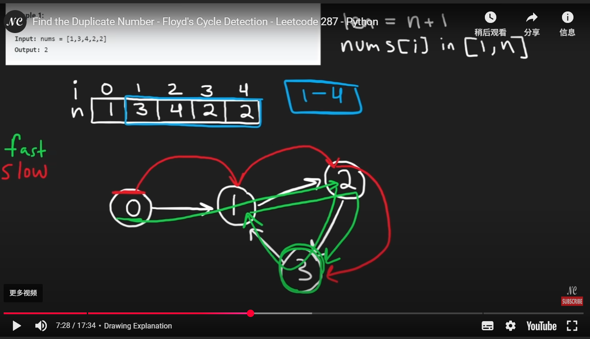

2nd slow2 start at the beginning, once the slow and slow2 reach, it means the duplicate is found.

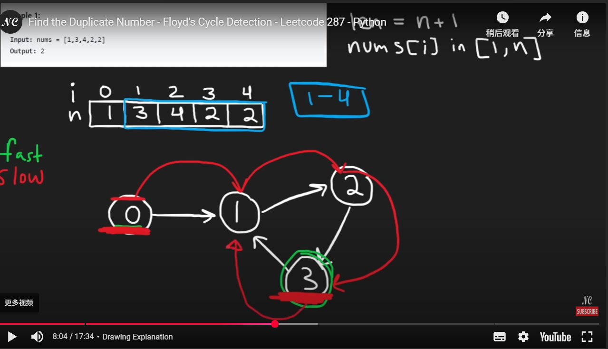

```python
class Solution:
    def findDuplicate(self, nums: List[int]) -> int:
        slow, fast = 0, 0
        while True:
            slow = nums[slow]
            fast = nums[nums[fast]]
            if slow == fast:
                break

        slow2 = 0
        while True:
            slow = nums[slow]
            slow2 = nums[slow2]
            if slow == slow2:
                return slow
```

https://www.geeksforgeeks.org/floyds-cycle-finding-algorithm/

Find the Starting Node of a Cycle in a Linked List

To find the starting node of a cycle in a linked list, follow the steps below:

> - Using above algorithm[ ](https://www.geeksforgeeks.org/detect-loop-in-a-linked-list/)we can find the ***\*meeting point (if cycle exists)\**** where the slow and fast pointers ***\*intersect\**** inside the cycle.
> - After detecting the cycle, reset one pointer ***\*(slow)\**** to the ***\*head\**** of the list. Keep the other pointer ***\*(fast)\**** at the meeting point.
> - Move both pointers ***\*one s\****tep at a time. The node where they meet again is the ***\*start\**** of the cycle.

## LRU cache

Doubly Linked List, practice, practice and practice ...

```python
class Node:
    def __init__(self, key=0, val=0, prev=None, next=None):
        self.key = key
        self.val = val
        self.prev = prev
        self.next = next

class LRUCache:

    def __init__(self, capacity: int):
        self.capacity = capacity
        self.cache = {}  # key: int -> Node
        self.start = Node()  # dummy head
        self.tail = Node()   # dummy tail
        self.start.next = self.tail
        self.tail.prev = self.start

    def get(self, key: int) -> int:
        if key in self.cache:
            node = self.cache[key]
            self._remove_node(node)
            self._add_node(node)
            return node.val
        return -1

    def put(self, key: int, value: int) -> None:
        if key in self.cache:
            node = self.cache[key]
            node.val = value
            self._remove_node(node)
            self._add_node(node)
        else:
            if len(self.cache) >= self.capacity:
                lru = self.tail.prev
                self._remove_node(lru)
                del self.cache[lru.key]
            new_node = Node(key, value)
            self._add_node(new_node)
            self.cache[key] = new_node

    def _add_node(self, node):
        # Always add to the front (right after dummy head)
        node.prev = self.start
        node.next = self.start.next
        self.start.next.prev = node
        self.start.next = node

    def _remove_node(self, node):
        # Detach from its neighbors
        prev = node.prev
        nxt = node.next
        prev.next = nxt
        nxt.prev = prev

```

## Merge K Sorted Linked Lists

The core idea is we can separate this question from merge multiple linked lists to merge 2 linked lists per time and it will eventually result into a single list.  Time: O(n logk), Space(k), k is the length of the input lists

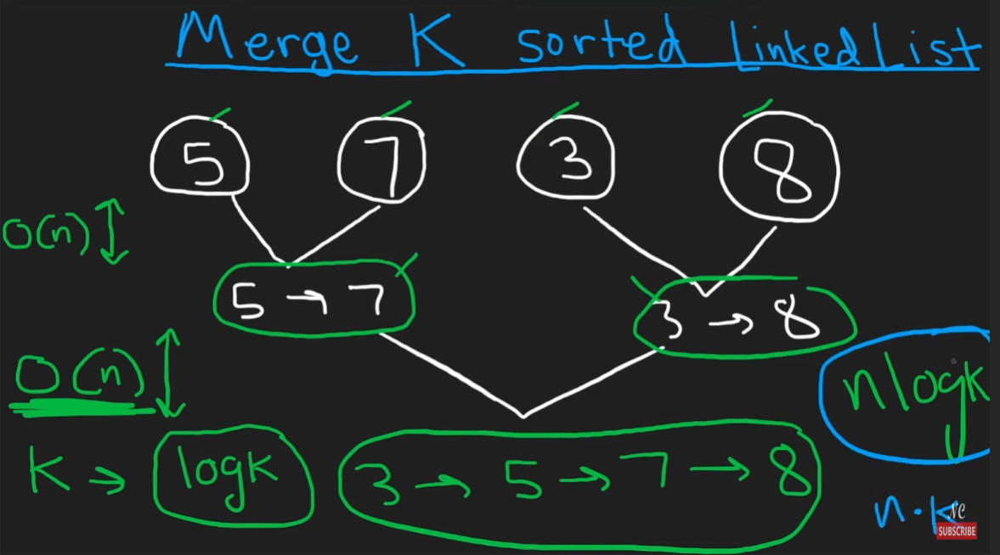

```python
class Solution:    
    def mergeKLists(self, lists: List[Optional[ListNode]]) -> Optional[ListNode]:
        # split the lists into 2 and merge every time and eventually it will converge to 1

        if not lists:
            return None

        while len(lists) > 1:
            merged_lists = []
            for i in range(0, len(lists), 2): # merge 2 lists each time
                l1 = lists[i]
                l2 = lists[i + 1] if i + 1 < len(lists) else None # may out of bounds
                merged_lists.append(self.mergeLists(l1, l2))
            lists = merged_lists

        return lists[0]

    def mergeLists(self, l1, l2):
        # Merge 2 lists and return the megered list
        dummy = tail = ListNode()
        while l1 and l2:
            if l1.val < l2.val:
                tail.next = l1
                l1 = l1.next
            else:
                tail.next = l2
                l2 = l2.next
            tail = tail.next
        if l1:
            tail.next = l1
        if l2:
            tail.next = l2
        return dummy.next

```

## Reverse Nodes in K-Group

The main idea is that we can split this question into the version of reverse linked list by comparing the end node after k steps. But we need to be very careful on relinking the reverse nodes.

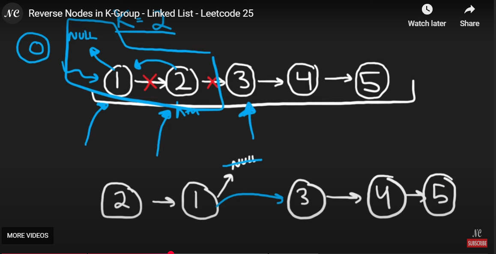

```python
# Definition for singly-linked list.
# class ListNode:
#     def __init__(self, val=0, next=None):
#         self.val = val
#         self.next = next

class Solution:
    def reverseKGroup(self, head: Optional[ListNode], k: int) -> Optional[ListNode]:
        if not head:
            return None

        start = dummy = ListNode(next = head)

        while True:
            end_k = self.getReversePos(k, start)
            
            if not end_k:
                break
            groupNext = end_k.next

            prev, curr = end_k.next, start.next
            # reverse linked lists
            while curr != groupNext:
                nxt = curr.next
                curr.next = prev
                prev = curr
                curr = nxt
            # complicated ->
            tmp = start.next # first node
            start.next = end_k # the kth reverse node position
            start = tmp # now the first node is pointing to the remaining linked list, we can use this as our start
        return dummy.next

    def getReversePos(self, k, l):
        while l and k > 0:
            l = l.next
            k -= 1
        return l
   
```


## Summary

After working through these linked list problems, several recurring **techniques** emerge, each with specific **scenarios** where they are most effective:

### 🟩 Two Pointers (Slow/Fast)

- **Finding the Middle Node**
   → Use slow and fast pointers. Fast moves 2 steps, slow moves 1. When fast reaches the end, slow is at the middle.
   ⤷ `middleNode`, `reorderList`
- **Cycle Detection**
   → Use the same pattern. If a cycle exists, slow and fast will eventually meet.
   ⤷ `hasCycle`, `findDuplicate` (array-based cycle)
- **Finding Cycle Start Point**
   → After detecting a cycle, reset one pointer to head and move both 1 step at a time. Their meeting point is the start of the cycle.
   ⤷ `findDuplicate` (Floyd's Tortoise & Hare)
- **Finding K-th Node from End**
   → Move `fast` pointer `n` steps ahead, then move both `slow` and `fast` together. When `fast` reaches the end, `slow` is at the target.
   ⤷ `removeNthFromEnd`

------

### 🟨 Reversing a Linked List

- **Full List Reverse**
   → Use `prev`, `curr`, and `nxt` to reverse pointers.
   ⤷ `reverseList`
- **Reverse Partial (e.g., K-group)**
   → Apply the same logic within a group. First validate group size using pointer traversal, then reverse in-place.
   ⤷ `reverseKGroup`
- **Helper for Complex Operations**
   → Used in problems like `reorderList` to reverse the second half before merging.

------

### 🟦 Dummy Node

- **Simplify Insert/Delete Operations**
   → Always use a dummy head when dealing with potential edge cases (e.g., inserting at head or removing head node).
   ⤷ `mergeTwoLists`, `removeNthFromEnd`, `addTwoNumbers`, `mergeKLists`

------

### 🟧 Hash Map

- **Track Correspondence Between Original and Copied Nodes**
   → Use when each node has more than just `.next` (e.g., random pointer).
   ⤷ `copyRandomList` (O(n) space solution)

------

### 🟥 Priority Queue / Divide and Conquer

- **Merging K Sorted Lists**
   → Use min-heap for O(N log K) or pairwise divide-and-conquer merges.
   ⤷ `mergeKLists`

------

### 🟨 Doubly Linked List + HashMap

- **LRU Cache**
   → Use a doubly linked list for ordering and hashmap for O(1) lookup and insert/remove.
   ⤷ `LRUCache`

------

### Key Takeaways

- **Linked List = Pointer Manipulation** → Understand how to disconnect/reconnect nodes safely.
- **Patterns are Reusable** → Nearly every complex linked list problem is a variation of a basic pattern.
- **Space vs. Time Trade-offs** → Know when to use extra space (e.g., HashMap) vs. clever pointer tricks (e.g., interleaving nodes in-place).

- ycle or locating duplicates when the input is constrained (e.g., values used as pointers).